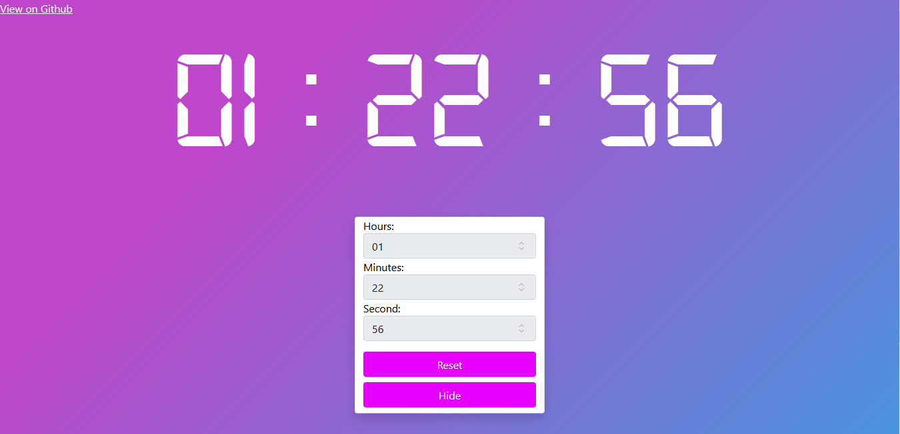
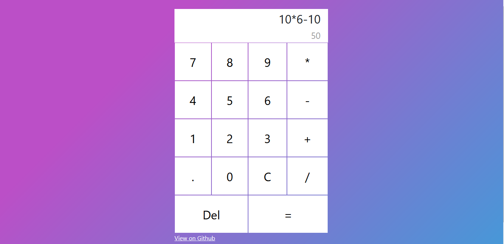
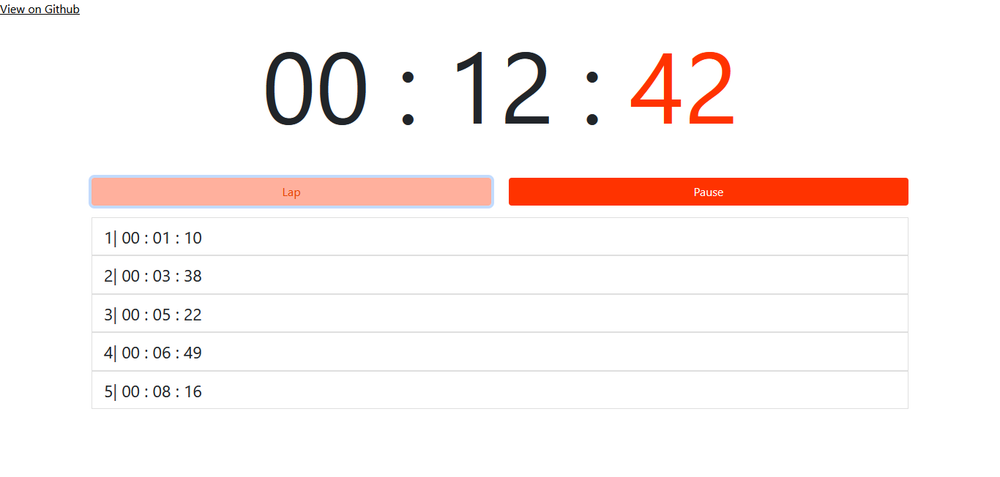
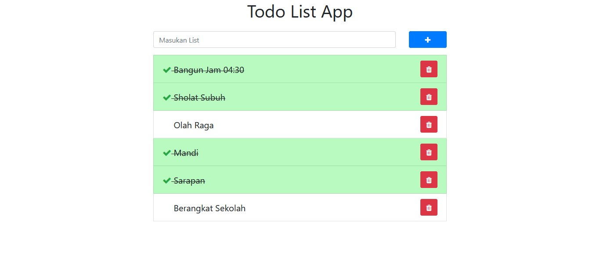

<!DOCTYPE html>
<html lang="en">
<head>
    <meta charset="UTF-8">
    <meta http-equiv="X-UA-Compatible" content="IE=edge">
    <meta name="viewport" content="width=device-width, initial-scale=1.0">
</head>
<body>
    

        <h1>Mini Project JavaScript</h1>
        <figure>
            
            <figcaption style="font-size: 30px">Countdown</figcaption>
            <a target="_blank" href="https://raw.githack.com/ryanm1928/Mini_Project_JavaScript/master/CountDown/index.html">show demo</a>
        </figure>
        

        <figure style="margin-top: 50px">
            
            <figcaption style="font-size: 30px">Kalkulator</figcaption>
            <a target="_blank" href="https://raw.githack.com/ryanm1928/Mini_Project_JavaScript/master/Kalkulator/index.html">show demo</a>
        </figure>
        

        <figure style="margin-top: 50px">
            
            <figcaption style="font-size: 30px">Stopwatch</figcaption>
            <a target="_blank" href="https://raw.githack.com/ryanm1928/Mini_Project_JavaScript/master/Stopwatch/index.html">show demo</a>
        </figure>
        

        <figure style="margin-top: 50px">
            
            <figcaption style="font-size: 30px">Todo List</figcaption>
            <a target="_blank" href="https://raw.githack.com/ryanm1928/Mini_Project_JavaScript/master/TodoListApp/index.html">show demo</a>
        </figure>
    

</body>
</html>
